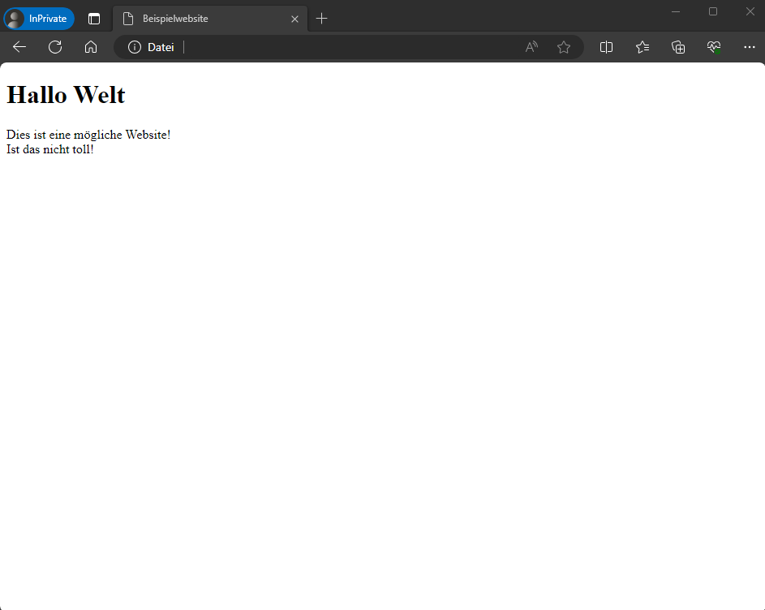

# Webserver - Die andere Seite des Internets

Dieses Projekt ist Teil des [Pre-Work-Pakets](../../../collection-it-prwrkpckg).

Zum besseren Verständnis empfehlen wir, vorher die Einführung für den [Raspberry Pi](../../../ge-it-prwrkpckg-raspberrypi) durchzuarbeiten.

## Inhaltsverzeichnis

1. [Hypertext Transfer Protocol (HTTP)](#hypertext-transfer-protocol-http)
2. [Uniform Resource Locator (URL)](#uniform-resource-locator-url)
3. [Aufbau einer Website mit HTML](#aufbau-einer-website-mit-html)
4. [Aufhübschen mit CSS](#aufhübschen-mit-css)
5. [Programmieren mit JavaScript](#programmieren-mit-javascript)
6. [Installation eines Webservers auf dem Raspberry Pi](#installation-eines-webservers-auf-dem-raspberry-pi)
7. [Einstellen einer Website](#einstellen-einer-website)
8. [Hinzufügen einer weiteren Seite](#hinzufügen-einer-weiteren-seite)

## Einleitung

Das Internet ist in der heutigen Zeit allgegenwärtig und findet in den verschiedensten Aspekten unseres Lebens Anwendung. Davon merken wir am meisten beim Benutzen von Webseiten. Jeder kann durch einen Browser schnell und ohne großes Vorwissen nur mithilfe von Suchmaschinen oder der Eingabe von Domainnamen auf verschiedenste Seiten zugreifen. Ob für Online-Shopping oder das Lesen von Nachrichten, um alltägliche Dinge zu erledigen springen wir meist - ohne uns Gedanken über die Funktionsweise zu machen - von Website zu Website. 

## Hypertext Transfer Protocol (HTTP)
Der zugrundeliegende Ablauf beim Aufrufen von Webseiten ist simpel: Der Browser fragt die Seite bei einem Webserver an und dieser antwortet mit dem Inhalt, der dann angezeigt wird. 

Um die Kommunikation zwischen Browser und Server zu vereinheitlichen kommt bei Webseiten das HTTP (Hypertext Transfer Protocol) zum Einsatz. Versucht der Browser, eine Website zu erreichen, sendet er eine sogenannte GET-Request an den angegebenen Webserver (beispielsweise google.com). Dieser sendet dann auf Basis der Request eine Antwort, die den Inhalt der Website darstellt.

Heutzutage wird meist HTTPS verwendet. Dabei handelt es sich um eine Erweiterung des HTTP Protokolls um Sicherheitsfunktionalität (S steht für *S*ecure). Die Website, die du im Laufe dieser Anleitung aufsetzen wirst, verwendet HTTP.

## Domains

Jeder Server hat im Internet eine eindeutige IP-Adresse. Damit man sich nicht die IP-Adressen von jedem einzelnen Server, den man aufrufen möchte, merken muss, wurde das Domain Name System (DNS) eingeführt. Im DNS kann man sich eindeutige [Domain-Namen](https://en.wikipedia.org/wiki/Domain_name) reservieren, die dann von DNS-Servern in die jeweiligen IP-Adressen aufgelöst werden. 

Sie erleichtern die Navigation im Internet erheblich, da man sich nicht die IP-Adressen der einzelnen Server merken muss, sondern einfach den Domainnamen in die Adresszeile des Browsers eingeben kann. 


Domains können zum Beispiel folgendermaßen aussehen:
- example.com
- blog.example.de

## Uniform Resource Locator (URL)

Eine GET-Request wird auf Grundlage einer URL erzeugt.
URL steht für Uniform Resource Locator und kann beispielsweise so aussehen:

```
  https://www.google.com/search?q=url
  \___/   \____________/ \____/ \___/
Protokoll      Host       Pfad  Query      
```

URLs können in vier Teile aufgeteilt werden:

|Abschnitt|Beschreibung|
|---|---|
|Protokoll| Als erstes wird in einer URL das Protokoll angegeben (oft HTTP oder HTTPS). |
|Host| Dieser Teil der URL gibt den Server an, an den die GET-Request gesendet werden soll. Das kann ein Domainname sein, aber auch eine einfach IP-Adresse. |
|Pfad| Der Pfad informiert den Webserver darüber, welche Seite des Servers der Benutzer öffnen möchte. Im oben dargestellten Beispiel steht `search` für die Seite, die die Suchfunktion von Google zur Verfügung stellt. |
|Query| Mit der Query (zu Deutsch "Abfrage") erhält der Webserver spezifischere Informationen. Man kann also über die Query Parameter an den Server übergeben. Sie befinden sich im Key-Value-Format. Mit der oberen Beispiel-URL sagen wir Google, dass der Begriff "url" gesucht werden soll. |


## Aufbau einer Website mit HTML

Websites verwenden heutzutage **HTML** (Hypertext Markup Language).
Mit dieser Sprache kann man schnell einfache Websites erstellen. So könnte der Quellcode einer möglichen Website aussehen:

```html
<!DOCTYPE html>
<html>
    <head>
        <title>Beispielwebsite</title>
    </head>
    <body>
        <h1>Hallo Welt</h1>
        <p>
            Dies ist eine mögliche Website!<br/> 
            Ist das nicht toll!
        </p>
    </body>
</html>
```

Und so sieht die Seite im Browser aus:



Betrachten wir den Quellcode einmal genauer: HTML setzt sich aus Elementen zusammen. Diese werden von Start-Tags (`<tag>`) und End-Tags (`</tag>`) begrenzt. Der Inhalt der Elemente befindet sich zwischen den beiden. Bei manchen Tags, die keinen Inhalt erwarten, kann man den End-Tag weglassen (siehe \<br>).


| Aspekt     | Beschreibung |
|---|---|
| \<!DOCTYPE html> | Dieser Tag ist speziell. Er teilt dem Browser mit, dass HTML als Sprache verwendet wird (muss am Anfang jeder Website stehen).|
| \<html><br>\</html> | Das ist das Root-Element, das in jedem Dokument vorkommen muss. Es umschließt die gesamte Webseite. |
| \<head><br>\</head> | In diesem Element befinden sich Meta-Informationen, wie beispielsweise der Seitentitel. |
| \<title><br>\</title> | Hiermit gibt man den Titel der Seite an (sichtbar in der Tab-Kachel des Browsers). |
| \<body><br>\</body> | Dieses Element beinhaltet den **sichtbaren** Inhalt der Website. |
| \<h1><br>\</h1> | Der Text, der sich zwischen diesen beiden Tags befindet, wird als Überschrift dargestellt.
| \<p><br>\</p> | Befindet sich Text zwischen zwei \<p>-Tags, wird er als Paragraph dargestellt (und hat einen vertikalem Abstand zu anderen Elementen).
| \<br> | Dieser Tag bringt den Browser dazu, an dieser Stelle einen Zeilenumbruch einzufügen.
| \<a href="[url]"><br>\</a> | Alles, was sich in diesem Element befindet, wird als Link dargestellt. Klickt ein Benutzer mit der Maus darauf, wird er auf die bei "href" angegebene Website weitergeleitet. |


**Hinweis**: Browser können Websites auch ohne \<!DOCTYPE html>, \<html>, \<head> und \<body> anzeigen. Sie fügen die fehlenden Tags einfach automatisch ein. Um aber Interpretationsfehler auf Seiten des Browsers zu vermeiden, sollten diese Tags immer vorhanden sein.

Neben den genannten Elementen gibt es noch viele weitere. Um mehr über HTML herauszufinden, kannst du [hier](https://www.w3schools.com/html/default.asp) klicken.


## Aufhübschen mit CSS

Die meisten Menschen sind sich einig, dass einfaches HTML für die heutigen Standards nicht mehr ausreichend ist. Deshalb wurde ein Standard entwickelt, der es erlaubt, die Seite zu "stylen". Um zum Beispiel die Hintergrundfarbe oder die Textgröße einzelner Elemente zu ändern, verwendet man **CSS** (Cascading Style Sheets).

Um mehr über CSS zu erfahren kannst du dir [hier](https://www.w3schools.com/css/default.asp) eine Einführung durchlesen.


## Programmieren mit JavaScript

Mit HTML und CSS kann man Webseiten darstellen und dabei schön aussehen lassen. Um aber mehr mit einer Website interagieren zu können verwenden Webentwickler in den den meisten Fällen JavaScript, dessen Erweiterung TypeScript oder ganze Frameworks, die die Entwicklung von Webseiten vereinfachen. Für Anfänger ist es aber ratsam, mit JavaScript anzufangen, da so ein Grundverständnis für die Webentwicklung erlangt werden kann. Wenn es dich interessiert, wie man mit JavaScript programmieren kann, kannst du [hier](https://www.w3schools.com/js/default.asp) mehr erfahren. 


## Installation eines Webservers auf dem Raspberry Pi

Es gibt verschiedene Anwendungen, die als Webserver fungieren. Wir verwenden auf dem [Raspberry Pi](../../../ge-it-prwrkpckg-raspberrypi) **nginx**. Dabei handelt es sich um einen kostenlosen, quelloffenen HTTP-Server, der für ca. ein Drittel aller Websites im Internet verwendet wird. Im Folgenden erfährst du, wie du nginx auf dem Raspberry Pi aufsetzen kannst.

Als erstes benötigst du das Terminal. Hier gibst du den folgenden Befehl ein:
```bash
sudo apt update && sudo apt upgrade
```
Dieser aktualisiert deinen Raspberry Pi und bringt ihn auf den neusten Stand.

Mit diesem Befehl installierst du nginx auf den Rechner:
```bash
sudo apt install nginx
```


Um sicher zu gehen, dass der Server läuft, kannst du den folgenden Befehl ausführen: 
```bash
sudo systemctl start nginx
```
Damit sich der Webserver bei Boot des Raspberry Pis automatisch startet, kannst du diesen Befehl ausführen:
```bash
sudo systemctl enable nginx
```


Der Webserver ist nun vollfunktionsfähig und einsatzbereit. Wenn du auf dem Raspberry Pi arbeitest, kannst du die Website im Browser anzeigen lassen, indem du `localhost` in die Adressleiste eingibst. Befindest du dich auf einem anderen im Netzwerk befindlichen Rechner, benötigst du die **IP-Adresse** des Pis. Wie du diese herausfindest, ist in der [Raspberry-Pi-Anleitung](../../../ge-it-prwrkpckg-raspberrypi#ssh) im Abschnitt SSH beschrieben.

Die URL zum Öffnen der Seite lautet also `http://localhost` bzw. `http://<ip>`.

> **Zusätzliche Informationen: Ports**<br>
> Computer verwenden beim Zugriff auf das Internet Ports. Insgesamt gibt es 65535 davon. 
> Um sich mit dem Internet verbinden zu können, belegt eine Anwendung einen Port (teilweise auch mehrere).  
> Man kann sich Ports wie Türen vorstellen, die die Anwendungen öffnen, um auf Datenpakete zu warten oder selbst welche zu versenden.
> Nur Nachrichten, die an den richtigen Port gerichtet sind, kommen auch bei der Anwendung an.  
> HTTP-Webserver verwenden standardmäßig Port 80, HTTPS-Server Port 443. Hostet man Webseiten nicht auf den Standardports, muss der verwendete Port in der URL angegeben werden: `http://<domainname/ip>:<Portnummer>`.


## Einstellen einer Website

### Einführung

Bei der Installation von nginx wurde automatisch eine vorkonfigurierte Website erstellt. Da man in den meisten Fällen eine eigene Seite anzeigen lassen möchte, wenn man einen Webserver verwendet, muss man diese Standardseite ändern.

nginx verwendet als Webseitenordner den Ordner `/var/www/html`, der automatisch erstellt wurde. Standardmäßig findest du hier die Datei `index.nginx-debian.html`, die eine vorgefertigte Begrüßungsseite enthält.

Wenn du im Browser eine URL eingibst, kannst du den Dateipfad und den Dateinamen (`http://example.com/test.html`) im Pfad-Teil angeben. Dann wird beispielsweise der Inhalt der Datei `var/www/html/test.html` vom Webserver zurückgesendet.
Gibst du keinen Dateinamen, also beispielsweise nur `http://example.com` an, antwortet der Webserver automatisch mit dem Inhalt der Datei mit dem Namen `index.html` (oder eine Variation davon, wie z. B. `index.nginx-debian.html`). Findet der Server keine Datei mit diesem Namen, gilt die Seite als Not Found (Error Code 404).

### Bearbeiten der Website

Um eine eigene Website schreiben zu können musst du die `index.html`-Seite bearbeiten. 

Um nicht jeden Befehl in `/var/www/html` mit Root-Rechten ausführen zu müssen, kannst du folgende Befehle eingeben. Sie berechtigen deinen Benutzer, die Dateien in diesem Ordner zu bearbeiten:

```bash
sudo chown -R www-data:<benutzername> /var/www/html/
sudo chmod -R 770 /var/www/html/
```

Zum einfacheren Verständnis wird in diesem Dokument nur mit `index.html`-Dateien gearbeitet. Du kannst die bereits existierende`index.nginx-debian.html`-Datei in `index.html` umbenennen, indem du den folgenden Befehl ausführst:

```bash
mv index.nginx-debian.html index.html
```

Nun kannst du die Datei mit diesem Befehl öffnen und bearbeiten:
```bash
nano index.html
```

Wenn du dir die Website im Browser anzeigen lässt, kannst du deine Änderungen direkt nach dem Speichern sehen (evtl. musst du aber zuerst die Seite neu laden). 

## Hinzufügen einer weiteren Seite

Die Website, die du im vorigen Kapitel erstellt hast, befindet sich im Quellordner des Servers (bei der URL wurde nichts in den Pfad-Teil eingetragen). Eine Website besteht meistens aber nicht nur aus einer einzigen Seite, sondern aus vielen verschiedenen, die untereinander verlinkt sind.

Um eine weitere Seite anzulegen, erstellst du einen Ordner, der den Zweck der Seite möglichst treffend beschreibt.
Willst du beispielsweise eine Informationsseite einrichten, kann der Ordner `info` heißen. Aus Übersichtlichkeitsgründen ist es wichtig, dass sich der Ordner in `/var/www/html` befindet (-> `/var/www/html/info`).

Im eben erstellten Ordner erstellst du eine Datei, die, wie die Hauptdatei im Ordner darüber, `index.html` heißt.
Hier kannst du eine weitere HTML-Seite erstellen.

### Registrieren der neuen Seite

Anders als bei manchen anderen Webservern, reicht es bei nginx nicht, einen Unterordner anzulegen, in dem sich eine weitere Index-Seite befindet. Es ist ein weiterer Schritt nötig, um sie aufrufbar zu machen: Du musst in der Konfigurationsdatei von nginx eine neue "location" anlegen.

Hierfür gehst du in den Seitenaktivierungsordner (`/etc/nginx/sites-enabled`) und öffnest die `default`-Datei mit einem Bearbeitungsprogramm, wie zum Beispiel in nano: `sudo nano default` (ACHTUNG: Du benötigst zum Schreiben Root-Rechte).

In der Datei suchst du nach der bereits existierenden root-location: 
```
location / {
    ...
}
```

Unter dieser fügst du nun den folgenden Textblock ein:

```
location /info/ {
    alias /var/www/html/info/;
}
```

Nachdem du die Änderung gespeichert hast, musst du nginx neu starten.
Das geht mit dem folgenden Befehl:

```bash
sudo systemctl restart nginx
```

Tadaa! Du hast soeben eine zweite Website registriert, die du nun über `localhost/info/` aufrufen kannst.
Als letzte Übung kannst du noch die neue Seite auf der Hauptseite verlinken: Füge dafür einfach ein Link-Element auf der Seite ein: `<a href="info/">Click me!</a>`.

